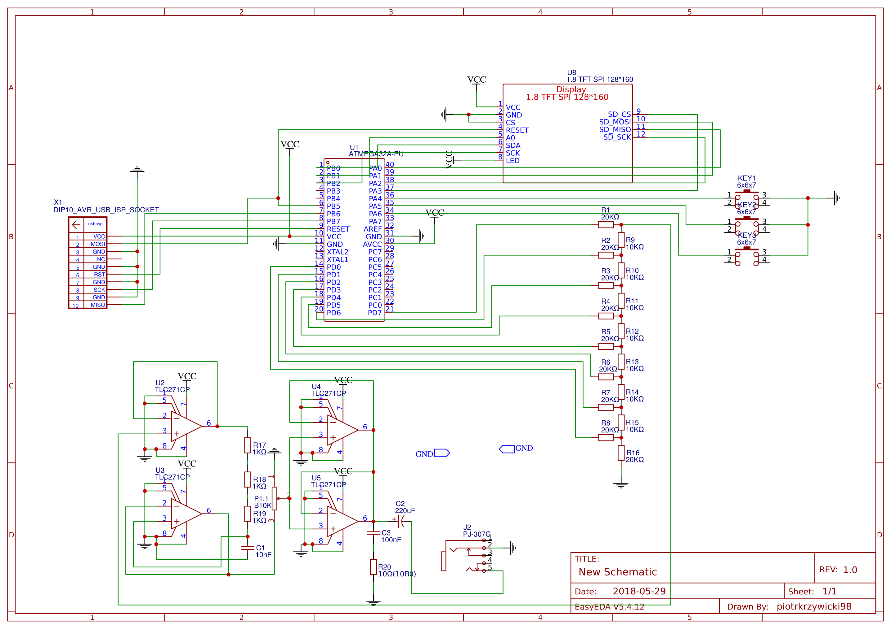
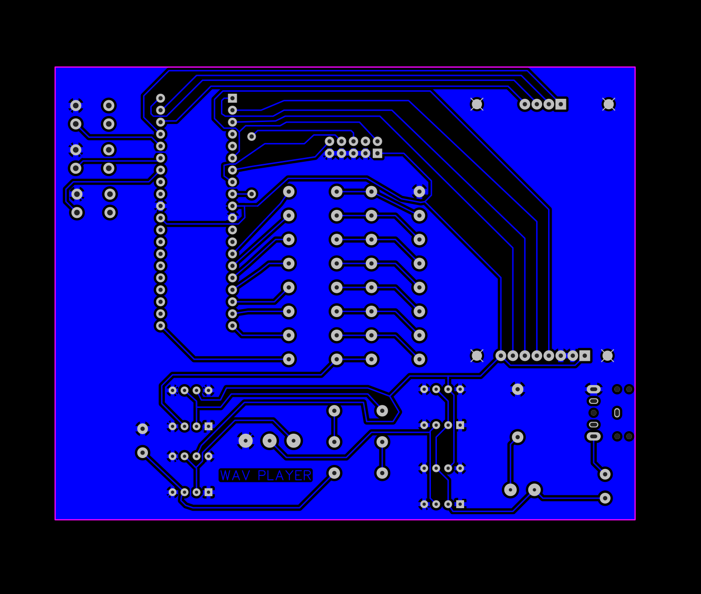

# wav-player

### Description
Simple wav playing device implementation - based on atmega32.
Supports only 8bit/8khz/mono wav files (16bit/44khz/stereo is a standard now), 
because of the hardware limitations. 

Device use SD-card through SPI interface, supporting FAT16/32 filesystem.
Uses popular library fat-fs: http://elm-chan.org/fsw/ff/00index_e.html.

In addition device use 1.8 tft screen with resolution 128x160:
https://www.displayfuture.com/Display/datasheet/controller/ST7735.pdf. 
It's managed by the library
https://github.com/cpldcpu/uTFT-ST7735.

To convert digital data from microcontroller do analog format, device is using r2r resistor ladder DAC (digital to analog converter).
https://en.wikipedia.org/wiki/Resistor_ladder.

To keep voltage constant and to supply enough current for headphones or speakers device is using 4 amplifiers:
http://www.ti.com/lit/ds/symlink/tlc271.pdf


Device has 3 tactile switches on board to navigate in filesystem or choosing song to play. One can also pause/resume/stop playing.
Volume can be regulated using included potentiometer.

### Building a project
```
mkdir build && cd build
cmake ..
make
```
Will result in building executable, which can be uploaded to device.

```
make hex
make upload
```
After building a project will result in uploading code to the device.

```
mkdir docs && cd docs
cmake ..
make doc
```
Will result in build documentation.

### Stages of the project





